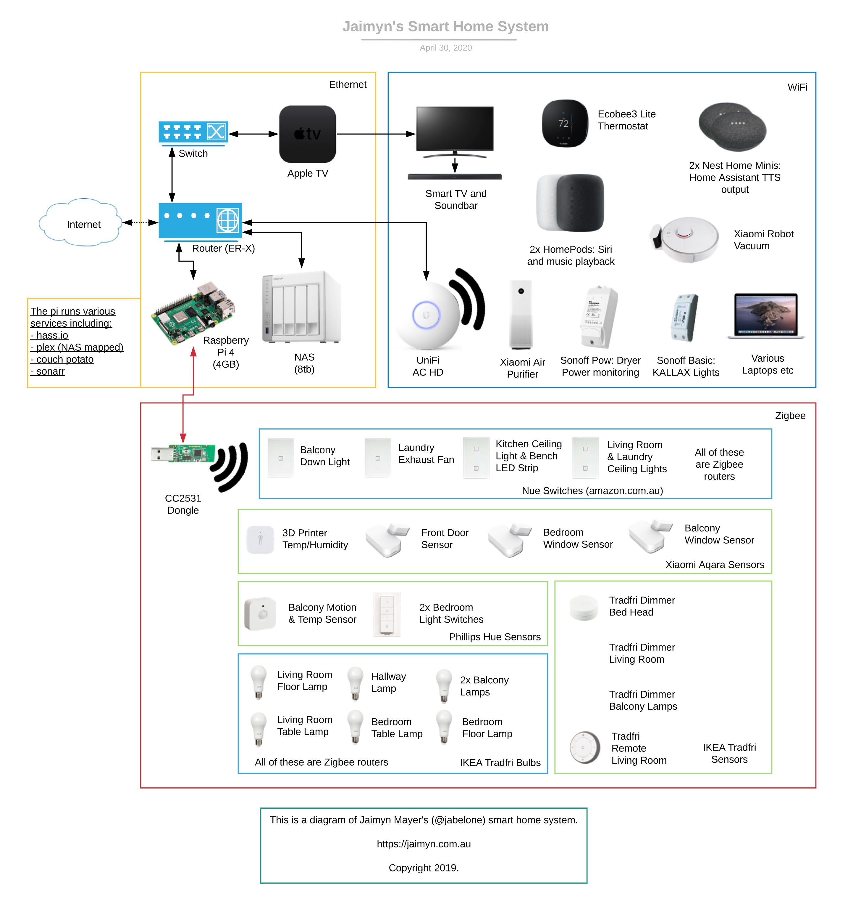

# Jaimyn’s Home Automation Setup
Welcome to my #smarthome repo. The goal of this repo is to publicly document my entire smart home in the hopes that it will inspire you to create and improve your own awesome smart home.

If you’d like to suggest any improvements or anything is unclear please feel free to create a new issue for discussion.

## Smart Home Context
Sometimes context is everything, so here it is. My home is a one bedroom apartment that I’m sharing with my partner. We live in Brisbane, Australia, in an apartment building right near the CBD. We have s fast fibre broadband connection delivered via the National Broadband Network (NBN).

## My Smart Home Philosophy
1) Visitors and guests should be able to control lights and appliances without asking how or thinking too hard about it.
2) Minimal disruption should occur if there are internet connectivity issues.
3) Cloud based lights and appliances should be avoided as these are often slow to control and are less reliable.
4) Reliability is important. Experiencing issues even 10% of the time is enough to kill usability.
5) Typical physical interactions in a non smart home should remain similar (ie light switches should behave the same).
6) WiFi based devices should be avoided.

These aren’t hard and fast rules that, but merely principles in which I think a good smart home should follow.

## My Smart Home (Overview)
I’ve created a high level diagram that shows most of the components of my smart home system. This diagram was created using [Lucidchart](https://Lucidchart.com) and various pictures of smart home appliances.

